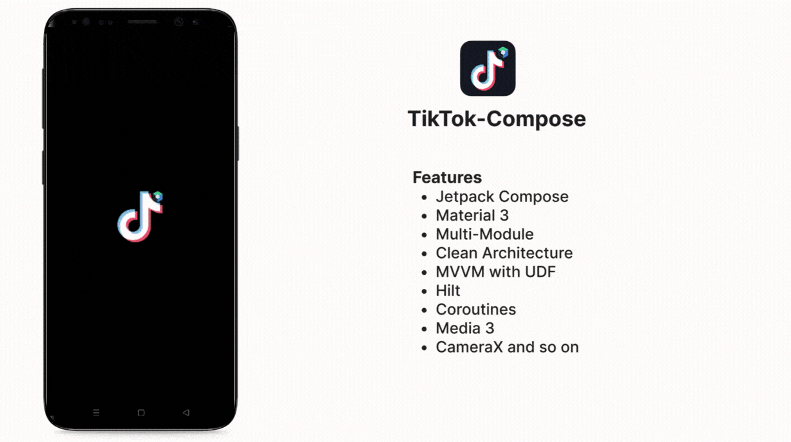
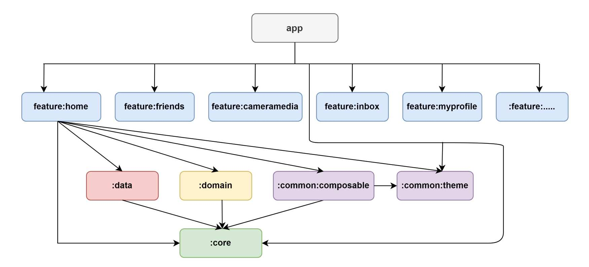

# TikTok-Compose

TikTok clone app built with Jetpack Compose following latest modern android development trend. Data shown in the app is from local data source, you can replace that with your own server api.

 

# Architecture
- Clean Architecture
- MVVM
- UDF (Unidirectioanl Data Flow)

 

# Modularization

To achieve low coupling, high cohesion with maximum reusability & scalable code base, this project is modularized.
This app consist of following modules:

- app
- feature
- data
- domain
- common
- core

  
  
  

# License

[http://www.apache.org/licenses/LICENSE-2.0](http://www.apache.org/licenses/LICENSE-2.0)

    Copyright 2023 Puskal khadka

    Licensed under the Apache License, Version 2.0 (the "License");
    you may not use this file except in compliance with the License.
    You may obtain a copy of the License at

      http://www.apache.org/licenses/LICENSE-2.0

    Unless required by applicable law or agreed to in writing, software
    distributed under the License is distributed on an "AS IS" BASIS,
    WITHOUT WARRANTIES OR CONDITIONS OF ANY KIND, either express or implied.
    See the License for the specific language governing permissions and
    limitations under the License.
